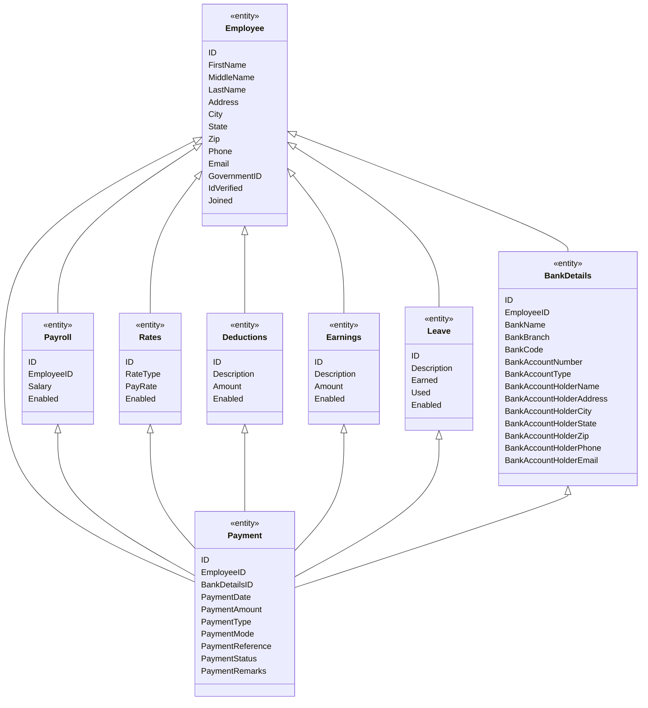

# Payroll System
## Description
This project is a payroll[^1] [^2]  system[^3] that allows the user to enter employee information and calculate their weekly/Monthly/Yearly pay. The user can also view a list of all employees and their information.

## Table of Contents
* [Tables](#tables)
  * [Employee](#employee)
  * [Rates](#rates)
  * [Deductions lookup](#deductions-lookup)
  * [Earnings lookup](#earnings-lookup)
  * [Leave lookup](#leave-lookup)
  * [Payroll](#payroll)
  * [Payment](#payment)
  * [Bank Details](#bank-details)
* [Usage](#usage)
* [Chart](#chart)
    * [Relationship diagram](#relationship-diagram)
    * [Class diagrams](#class-diagrams)

## Tables

## Employee

### Design

> [!NOTE]
> *This table will have the basic details about the employee. Middle name is optional. IdVerified is a bit field which will have 0 or 1. 0 means GovernmentID not verified and 1 means verified. Joined field will have the date when the employee joined the company. PayrollID is a foreign key which will have the primary key of the payroll table.*

| Column Name | Data Type | Description | required |
| ----------- | --------- | ----------- | -------- |
| ID | int | Primary key for the employee table | `yes` |
| FirstName | varchar(50) | First name of the employee | `yes` |
| MiddleName | varchar(50) | Middle name of the employee | **no** |
| LastName | varchar(50) | Last name of the employee |  `yes` |
| Address | varchar(50) | Address of the employee | `yes` |
| City | varchar(50) | City of the employee |   `yes` |
| State | varchar(50) | State of the employee | `yes` |
| Zip | varchar(50) | Zip code of the employee |    `yes` |
| Phone | varchar(50) | Phone number of the employee |  `yes` |   
| Email | varchar(50) | Email address of the employee | `yes` |
| GovernmentID | varchar(50) | Government ID of the employee | `yes` |
| IdVerified | bit | Whether or not the employee's ID has been verified |  `yes` |
| Joined | date | Date the employee joined the company | `yes` |

### Script

```sql
CREATE TABLE Employee (
    ID SERIAL PRIMARY KEY,
    FirstName VARCHAR(50) NOT NULL,
    MiddleName VARCHAR(50),
    LastName VARCHAR(50) NOT NULL,
    Address VARCHAR(50) NOT NULL,
    City VARCHAR(50) NOT NULL,
    State VARCHAR(50) NOT NULL,
    Zip VARCHAR(50) NOT NULL,
    Phone VARCHAR(50) NOT NULL,
    Email VARCHAR(50) NOT NULL,
    GovernmentID VARCHAR(50) NOT NULL,
    IdVerified BIT NOT NULL default 0,
    Joined DATE NOT NULL
);
```
## Rates.
Pay rate based on Paytype.

> [!NOTE]
> *Paytype can be specified as hourly 24 hours for daily. 168 hours for weekly. 730 hours for monthly. 8760 hours for yearly. Assuming 8 hours per day and 5 days per week. 40 hours per week. 160 hours per month. 2080 hours per year. The formula for calculating the hourly rate is as follows: Hourly Rate = (Annual Salary / 2080) * 1.5. The formula for calculating the daily rate is as follows: Daily Rate = (Annual Salary / 260) * 1.5. The formula for calculating the weekly rate is as follows: Weekly Rate = (Annual Salary / 52) * 1.5. The formula for calculating the monthly rate is as follows: Monthly Rate = (Annual Salary / 12) * 1.5. Also OT rate is 1.5 times the normal rate. OT rate is applicable only for hourly rate. OT rate is not applicable for salary rate.*

| Column Name | Data Type | Description | required |
| ----------- | --------- | ----------- | -------- |
| ID | int | Primary key for the payroll table | `yes` |
| RateType | int | Type of the rate. 1 for hourly and 2 for salary | `yes` |
| PayRate | decimal(18,2) | Pay rate of the employee | `yes` |
| Enabled | bit | Whether or not the rate is enabled | `yes` |

### Script
```sql
CREATE TABLE Rates (
    ID SERIAL PRIMARY KEY,
    RateType INT NOT NULL,
    PayRate DECIMAL(18,2) NOT NULL,
    Enabled BIT NOT NULL default 1
);
```
## Deductions lookup.

This table will have the details about detections that are applicable. each entry in the table can be mapped to a employee
> [!NOTE]
> *Income tax, Professional tax, Provident fund, Employee State Insurance, Other deductions*

| Column Name | Data Type | Description | required |
| ----------- | --------- | ----------- | -------- |
| ID | int | Primary key for the employee table | `yes` |
| Description | varchar(50) | Description of the detection | `yes` |
| Amount | decimal(18,2) | Amount of the detection | `yes` |
| Enabled | bit | Whether or not the rate is enabled | `yes` |

### Script
```sql
CREATE TABLE Deductions (
    ID SERIAL PRIMARY KEY,
    Description VARCHAR(50) NOT NULL,
    Amount DECIMAL(18,2) NOT NULL,
    Enabled BIT NOT NULL default 1
);
```
## Earnings lookup.

This table will have the details about earnings that are applicable. each entry in the table can be mapped to a employee
> [!NOTE]
> *Salary earnings are the fixed amount of compensation that an employee receives for their work, usually on a monthly or annual basis. Salary earnings vary depending on the job title, skills, experience, education, industry, and location of the employee.*

| Column Name | Data Type | Description | required |
| ----------- | --------- | ----------- | -------- |
| ID | int | Primary key for the employee table | `yes` |
| Description | varchar(50) | Description of the earning | `yes` |
| Amount | decimal(18,2) | Amount of the earning | `yes` |
| Enabled | bit | Whether or not the rate is enabled | `yes` |

### Script
```sql
CREATE TABLE Earnings (
    ID SERIAL PRIMARY KEY,
    Description VARCHAR(50) NOT NULL,
    Amount DECIMAL(18,2) NOT NULL,
    Enabled BIT NOT NULL default 1
);
```
## Leave lookup.
Leave details of the employee.
> [!NOTE]
> *Privilege Leave (PL) / Earned Leave (EL) / Annual Leave (AL),
Casual Leave (CL),
Sick Leave (SL),
Maternity Leave (ML),
Marriage Leave,
Paternity Leave,
Bereavement Leave,
Compensatory Off (comp-off),
Loss Of Pay Leave (LOP/LWP)*

| Column Name | Data Type | Description | required |
| ----------- | --------- | ----------- | -------- |
| ID | int | Primary key for the employee table | `yes` |
| Description | varchar(50) | Description of the leave | `yes` |
| Earned | decimal(5,2) | Amount of the leave earned | `yes` |
| Used | decimal(5,2) | Amount of the leave used | `yes` |
| Enabled | bit | Whether or not the rate is enabled | `yes` |

### Script
```sql
CREATE TABLE Leave (
    ID SERIAL PRIMARY KEY,
    Description VARCHAR(50) NOT NULL,
    Earned DECIMAL(5,2) NOT NULL,
    Used DECIMAL(5,2) NOT NULL,
    Enabled BIT NOT NULL default 1
);
```
## Payroll
This table will have the link between employee and rates, deductions, earnings and leave. each entry in the table is either a rate, deduction, earning or leave for an employee.

> [!NOTE]
> *Being a link table it will have primary key and foregin key to Employee. Each employee will have multiple entries for each of the rates, deductions, earnings and leave.*

| Column Name | Data Type | Description | required |
| ----------- | --------- | ----------- | -------- |
| ID | int | Primary key for the employee table | `yes` |
| EmployeeID | int | Foreign key for the employee table | `yes` |
| Salary | int | Salary of the employee | `yes` |
| Enabled | bit | Whether or not the rate is enabled | `yes` |

### Script
```sql
CREATE TABLE Payroll (
    ID SERIAL PRIMARY KEY,
    EmployeeID INT NOT NULL,
    Salary INT NOT NULL,
    Enabled BIT NOT NULL default 1
);
```

## Payment
This table will have the details about the payment made to the employee. each entry in the table is a payment made to an employee.

> [!NOTE]
> *This table will have the details about the payment made to the employee. each entry in the table is a payment made to an employee. It will have the employee id, payment date, payment amount, payment type, payment mode, payment reference, payment status, payment remarks.*

| Column Name | Data Type | Description | required |
| ----------- | --------- | ----------- | -------- |
| ID | int | Primary key for the employee table | `yes` |
| EmployeeID | int | Foreign key for the employee table | `yes` |
| BankDetailsID | int | Foreign key for the bank details table | `yes` |
| PaymentDate | date | Date of the payment | `yes` |
| PaymentAmount | decimal(18,2) | Amount of the payment | `yes` |
| PaymentType | int | Type of the payment. 1 for salary, 2 for deduction, 3 for earning, 4 for leave | `yes` |
| PaymentMode | int | Mode of the payment. 1 for cash, 2 for check, 3 for bank transfer | `yes` |
| PaymentReference | varchar(50) | Reference of the payment | `yes` |
| PaymentStatus | int | Status of the payment. 1 for paid, 2 for unpaid | `yes` |
| PaymentRemarks | varchar(50) | Remarks of the payment | `yes` |

### Script
```sql
CREATE TABLE Payment (
    ID SERIAL PRIMARY KEY,
    EmployeeID INT NOT NULL,
    PaymentDate DATE NOT NULL,
    PaymentAmount DECIMAL(18,2) NOT NULL,
    PaymentType INT NOT NULL,
    PaymentMode INT NOT NULL,
    PaymentReference VARCHAR(50) NOT NULL,
    PaymentStatus INT NOT NULL,
    PaymentRemarks VARCHAR(50) NOT NULL
);
```

## Bank Details
This table will have the details about the bank account of the employee. each entry in the table is a bank account of an employee.

> [!NOTE]
> *This table will have the details about the bank account of the employee. each entry in the table is a bank account of an employee. It will have the employee id, bank name, bank branch, bank account number, bank account type, bank account holder name, bank account holder address, bank account holder city, bank account holder state, bank account holder zip, bank account holder phone, bank account holder email.*


| Column Name | Data Type | Description | required |
| ----------- | --------- | ----------- | -------- |
| ID | int | Primary key for the employee table | `yes` |
| EmployeeID | int | Foreign key for the employee table | `yes` |
| BankName | varchar(50) | Name of the bank | `yes` |
| BankBranch | varchar(50) | Branch of the bank | `yes` |
| BankCode | varchar(50) | Code of the bank | `yes` |
| BankAccountNumber | varchar(50) | Account number of the bank | `yes` |
| BankAccountType | int | Type of the bank account. 1 for savings, 2 for current | `yes` |
| BankAccountHolderName | varchar(50) | Name of the bank account holder | `yes` |
| BankAccountHolderAddress | varchar(50) | Address of the bank account holder | `yes` |
| BankAccountHolderCity | varchar(50) | City of the bank account holder | `yes` |
| BankAccountHolderState | varchar(50) | State of the bank account holder | `yes` |
| BankAccountHolderZip | varchar(50) | Zip of the bank account holder | `yes` |
| BankAccountHolderPhone | varchar(50) | Phone of the bank account holder | `yes` |
| BankAccountHolderEmail | varchar(50) | Email of the bank account holder | `yes` |


### Script
```sql
CREATE TABLE BankDetails (
    ID SERIAL PRIMARY KEY,
    EmployeeID INT NOT NULL,
    BankName VARCHAR(50) NOT NULL,
    BankBranch VARCHAR(50) NOT NULL,
    BankCode VARCHAR(50) NOT NULL,
    BankAccountNumber VARCHAR(50) NOT NULL,
    BankAccountType INT NOT NULL,
    BankAccountHolderName VARCHAR(50) NOT NULL,
    BankAccountHolderAddress VARCHAR(50) NOT NULL,
    BankAccountHolderCity VARCHAR(50) NOT NULL,
    BankAccountHolderState VARCHAR(50) NOT NULL,
    BankAccountHolderZip VARCHAR(50) NOT NULL,
    BankAccountHolderPhone VARCHAR(50) NOT NULL,
    BankAccountHolderEmail VARCHAR(50) NOT NULL
);
```

## Chart


### Relationship diagram with field names.
    
```mermaid
erDiagram
    Employee ||--o{ Payroll : "ID"
    Employee ||--o{ Rates : "ID"
    Employee ||--o{ Deductions : "ID"
    Employee ||--o{ Earnings : "ID"
    Employee ||--o{ Leave : "ID"
    Employee ||--o{ Payment : "ID"
    Employee ||--o{ BankDetails : "ID"
    Payroll ||--o{ Payment : "ID"
    Rates ||--o{ Payment : "ID"
    Deductions ||--o{ Payment : "ID"
    Earnings ||--o{ Payment : "ID"
    Leave ||--o{ Payment : "ID"
    BankDetails ||--o{ Payment : "ID"
    Employee {
        ID int
        FirstName varchar(50)
        MiddleName varchar(50)
        LastName varchar(50)
        Address varchar(50)
        City varchar(50)
        State varchar(50)
        Zip varchar(50)
        Phone varchar(50)
        Email varchar(50)
        GovernmentID varchar(50)
        IdVerified bit
        Joined date
    }
    Payroll {
        ID int
        EmployeeID int
        Salary int
        Enabled bit
    }
    Rates {
        ID int
        RateType int
        PayRate decimal(18,2)
        Enabled bit
    }
    Deductions {
        ID int
        Description varchar(50)
        Amount decimal(18,2)
        Enabled bit
    }
    Earnings {
        ID int
        Description varchar(50)
        Amount decimal(18,2)
        Enabled bit
    }
    Leave {
        ID int
        Description varchar(50)
        Earned decimal(5,2)
        Used decimal(5,2)
        Enabled bit
    }
    Payment {
        ID int
        EmployeeID int
        BankDetailsID int
        PaymentDate date
        PaymentAmount decimal(18,2)
        PaymentType int
        PaymentMode int
        PaymentReference varchar(50)
        PaymentStatus int
        PaymentRemarks varchar(50)
    }
    BankDetails {
        ID int
        EmployeeID int
        BankName varchar(50)
        BankBranch varchar(50)
        BankCode varchar(50)
        BankAccountNumber varchar(50)
        BankAccountType int
        BankAccountHolderName varchar(50)
        BankAccountHolderAddress varchar(50)
        BankAccountHolderCity varchar(50)
        BankAccountHolderState varchar(50)
        BankAccountHolderZip varchar(50)
        BankAccountHolderPhone varchar(50)
        BankAccountHolderEmail varchar(50)
    }
```


### Class diagrams.
    


## Basic payroll calculation
This is just a basic formula to calculate salary. This formula does not take into account the deductions and earnings. This formula is just for reference. The actual formula will be different.

```math
\text{Basic Pay} = \text{Pay Rate} \times \text{Hours Worked}
```

## Basic salary calculation for hourly rate with overtime calculation
This is just a basic formula to calculate salary. This formula does not take into account the deductions and earnings. This formula is just for reference. The actual formula will be different.

```math
\text{Basic Pay} = \text{Pay Rate} \times \text{Hours Worked} + \text{OT Rate} \times \text{OT Hours Worked}
```

## Salary deduction with income tax calculation
This is just a basic formula to calculate salary. This formula does not take into account the deductions and earnings. This formula is just for reference. The actual formula will be different.

```math
\text{Deduction} = \text{Income Tax} + \text{Professional Tax} + \text{Provident Fund} + \text{Employee State Insurance} + \text{Other Deductions}
```

[^1]: My reference [Writing Efficient Payroll Calculation Formulas](https://docs.oracle.com/cd/E18727-01/doc.121/e14567/T1774T1776.htm#I_efficpay) and [What is payroll software](https://www.oracle.com/in/human-capital-management/payroll/what-is-payroll-software/)

[^2]: [Payroll for India](https://www.oracle.com/in/a/ocom/docs/applications/hcm/oracle-payroll-for-india.pdf)

[^3]: [Payroll](https://www.oracle.com/in/human-capital-management/payroll/#india)